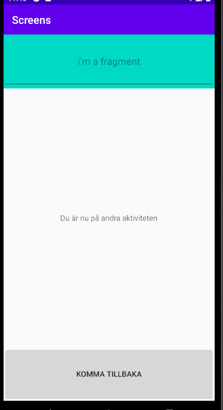

# Rapport Screens


## Activity_main (layout)
i min activity_main skapades en knapp. Den har id knapp, texten i knappen är "Klicka här för att komma till nästa sida!". Den består utav layout-typen contraint.
Med hjälp utav id:et kan knappen sedan manipuleras i java.
```
<Button
        android:id="@+id/knapp"
        android:layout_width="wrap_content"
        android:layout_height="wrap_content"
        android:text="Klicka här för att komma till nästa sida!"
        app:layout_constraintBottom_toBottomOf="parent"
        app:layout_constraintLeft_toLeftOf="parent"
        app:layout_constraintRight_toRightOf="parent"
        app:layout_constraintTop_toTopOf="parent" />
```
## MainActivity (java)

I java skapas en OnClickListener. Vilket innebär att att onClick-funktionen läggs den kod vilket ska hända när användaren klickar på knappen. I detta fallet har en intent
skapats. Detta gör det möjligt att byta till en annan aktivitet vid klicket. I koden finns stycket "onClickActivity.class". Det är alltså den aktiviteten som kommer att
köras vid klick på knappen. Funktionnen startactivty(intent) körs vid klicket och i Intent variabeln ligger då att den ska byta till onClickActivity. Dock innan den ska kunna
byta till en annan aktivitet behöver denna aktivieten skapas. Detta visas under koden nedan.

```

       protected void onCreate(Bundle savedInstanceState) {
        super.onCreate(savedInstanceState);
        setContentView(R.layout.activity_main);

        Button knapp = findViewById(R.id.knapp);
        knapp.setOnClickListener(new View.OnClickListener() {
            @Override
            public void onClick(View v) {
                Intent intent = new Intent(MainActivity.this,  OnClickActivity.class);
                startActivity(intent);
            }
        });
    }
}
```
## Bild på första aktiviten:


## activity_on_click & OnclickAcitivity (layout & java)

I den andra aktiviten skapades först en textView samt en button. Likt koden ovan har id:et på button använts i OnClickActivity. Alltså i java koden. Med ett klick
på knappen kommer man tillbaka till MainActivity. Detta görs som tidigare nämnt med en onClickListener, där man sedan kan fylla i vad som ska hända när knappen klickas på.
I detta fallet används funktionen finish();, vilket innebär att vid ett klick på knappen så kommer aktiviteten avslutas. Main activity körs i bakgrunden hela tiden och när
OnClickActivity stängs kommer denna att visas igen.

```
    <TextView
        android:layout_width="wrap_content"
        android:layout_height="wrap_content"
        app:layout_constraintBottom_toBottomOf="parent"
        app:layout_constraintLeft_toLeftOf="parent"
        app:layout_constraintRight_toRightOf="parent"
        app:layout_constraintTop_toTopOf="parent"
        android:text="Du är nu på andra aktiviteten" />

    <Button
        android:id="@+id/close"
        android:layout_width="match_parent"
        android:layout_height="100dp"
        app:layout_constraintBottom_toBottomOf="parent"
        app:layout_constraintLeft_toLeftOf="parent"
        app:layout_constraintRight_toRightOf="parent"
        android:text="Komma tillbaka"/>
```
```
Button closeActivity = findViewById(R.id.close);
        closeActivity.setOnClickListener(new View.OnClickListener() {
            @Override
            public void onClick(View v) {
                finish();
            }
        });
    }
```
## Fragment
Till min OnClickActivity har ett fragment kopplats. Dett fragment är skapat och döpt till FirstFragment. Fragmentet innehåller en EditText-vy. Det vill säga en vy
där användaren får mata in text. Den har även en hint, alltså en text som står innan användaren skriver in egen text. Gravity="center" används för centrera texten.


```
<EditText
        android:layout_width="match_parent"
        android:layout_height="match_parent"
        android:gravity="center"
        android:hint="i'm a fragment" />
```
## Koppla ihop fragment och aktivitet
Nu finns det ett fragment, dock så är denna inte ihopkopplad med en aktivtet än. Det vill säga att den inte kommer visas någonstans. Eftersom att jag vill att den
ska synas i min OnClickActivity. Så behövs fragementen läggas till min activity_on_click.xml. Likt koden nedan. För att sedan påvisa vilket fragment som ska kopplas ihop
med aktiviteten visas hur det detta görs på första raden. Där mappen fragmenten ligger i samt namnet på fragmentet visar på vilket fragment det är. Detta resulterar i att
vi kommer se en EditText i OnClickActivity då FirstFragment består utav detta.
```
<fragment
        android:name="com.example.screens.FirstFragment"
        android:layout_width="match_parent"
        android:layout_height="100dp"
        android:tag="fragment_frist"
        app:layout_constraintEnd_toEndOf="parent"
        app:layout_constraintStart_toStartOf="parent"
        app:layout_constraintTop_toTopOf="parent" />

```
## Bild på andra aktiviteten:

Läs gärna:

- Boulos, M.N.K., Warren, J., Gong, J. & Yue, P. (2010) Web GIS in practice VIII: HTML5 and the canvas element for interactive online mapping. International journal of health geographics 9, 14. Shin, Y. &
- Wunsche, B.C. (2013) A smartphone-based golf simulation exercise game for supporting arthritis patients. 2013 28th International Conference of Image and Vision Computing New Zealand (IVCNZ), IEEE, pp. 459–464.
- Wohlin, C., Runeson, P., Höst, M., Ohlsson, M.C., Regnell, B., Wesslén, A. (2012) Experimentation in Software Engineering, Berlin, Heidelberg: Springer Berlin Heidelberg.
